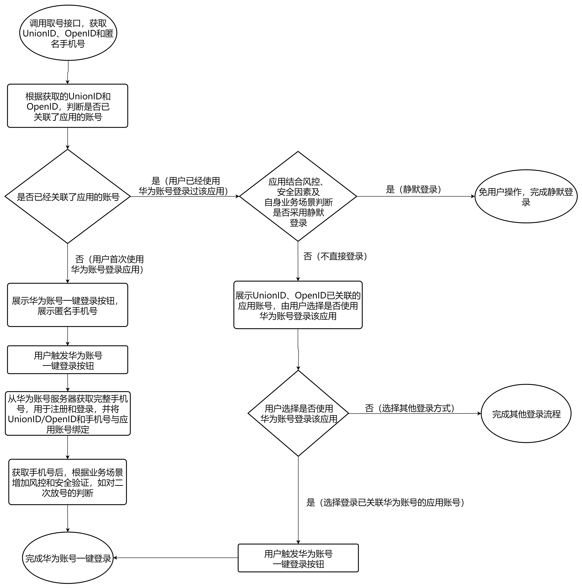
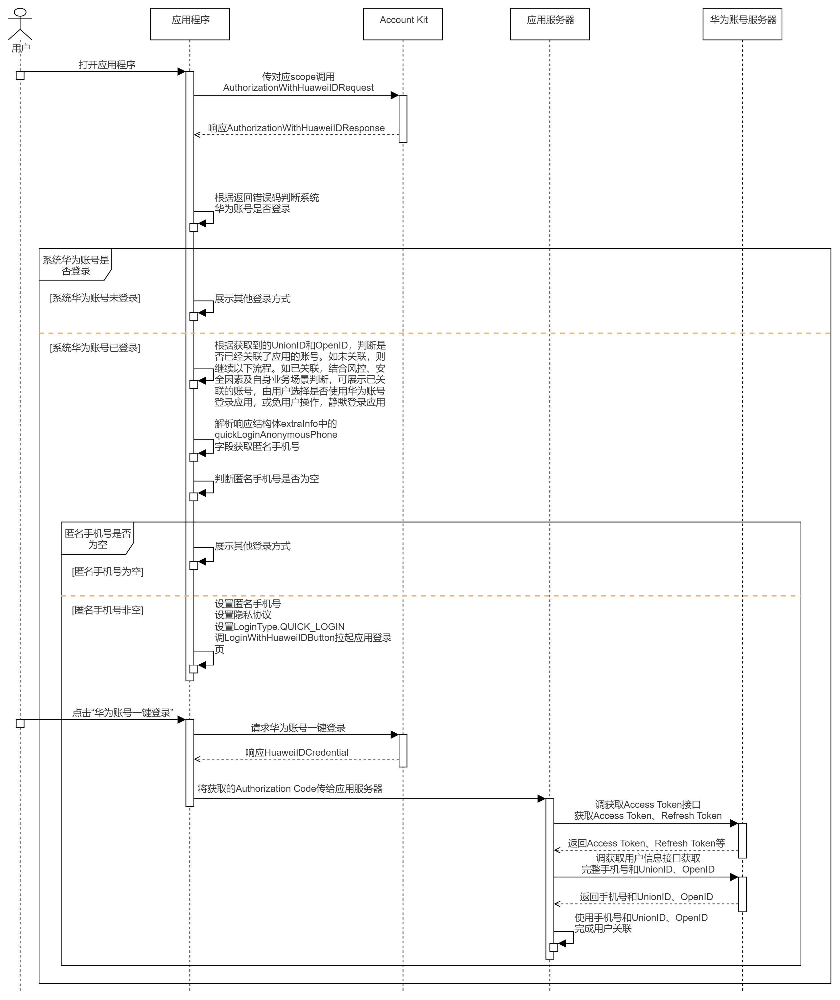
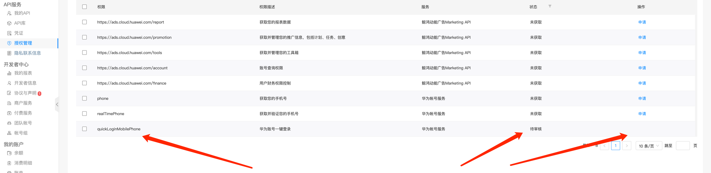
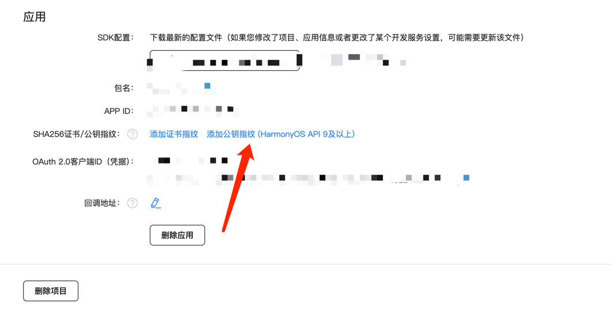

# 华为账号一键登录

https://developer.huawei.com/consumer/cn/doc/harmonyos-guides-V5/account-kit-guide-V5


## 一键登录特点

1. 一键完成登录和手机号授权
2. 无需单独集成SDK
3. 通过手机号和UnionID与应用原有用户体系进行关联。

## 申请一键登录功能



## 添加公钥指纹



指纹配置成功后大约10分钟左右生效，请您耐心等待。

## 配置Client ID - 告诉华为你是哪个应用

./entry/src/main/module.json5

```json
{
  "module": {
    "name": "entry",
    "requestPermissions": [],
    "metadata": [
      {
        "name": "client_id",
        "value": "xxx"
      }
    ]
  }
}
```

## 


## 常见错误

### Failed to check the fingerprint of the app bundle.Incomplete response information from gateway.

{"code":1001500001,"message":"Failed to check the fingerprint of the app bundle.Incomplete response information from gateway."}


client_id 无效

### Failed to check the fingerprint of the app bundle.Fingerprint verification error.

{"code":1001500001,"message":"Failed to check the fingerprint of the app bundle.Fingerprint verification error."}


应用的指纹证书未配置或配置错误。


存在如下异常场景：
1）返回1001502001 华为账号未登录错误码，说明华为账号未登录。

2）返回1001500003 不支持该scopes或permissions错误码，说明华为账号用户注册地非中国大陆或登录的华为账号是儿童账号。

3）获取到的匿名手机号为空，说明华为账号没有绑定手机号、权限未申请或未生效。
